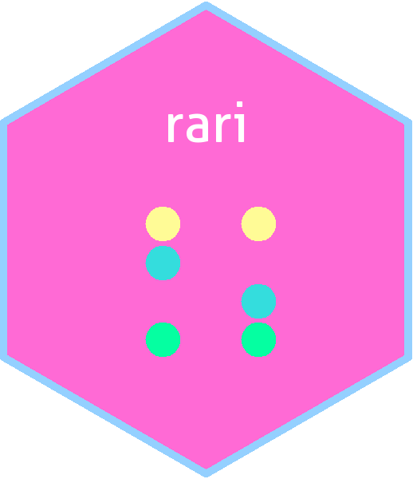
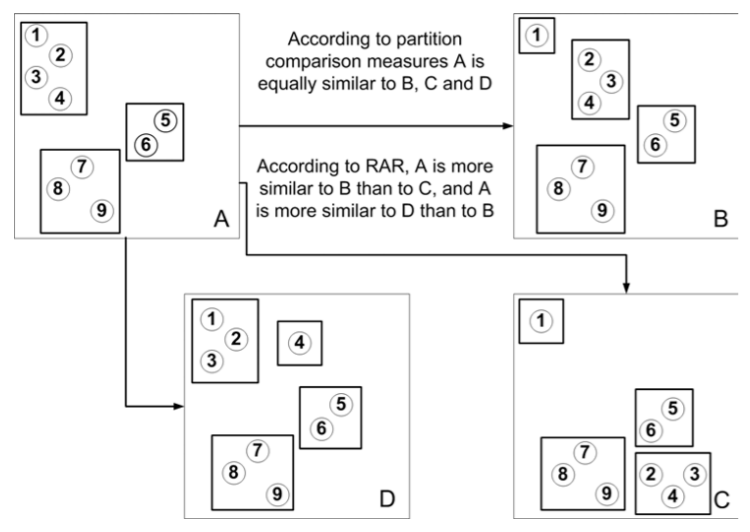
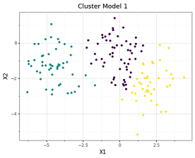
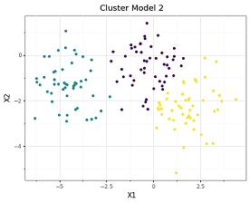
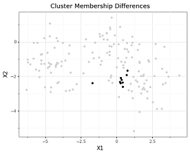
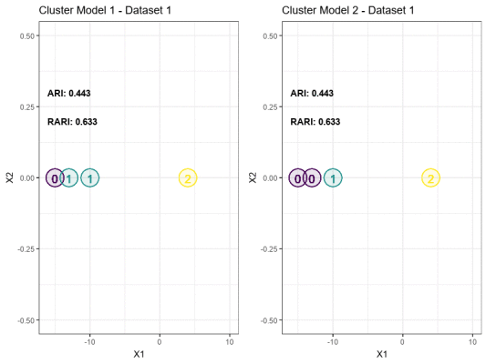

[](https://www.tidyverse.org/lifecycle/#experimental)

# package.rari 

`rari` is a Python implementation of Pinto et. al's ranked adjusted Rand index (RARI) from
[Ranked Adjusted Rand: integrating distance and partition information in a measure of clustering agreement](https://doi.org/10.1186/1471-2105-8-44).
RARI is an extension of the [adjusted Rand index](https://en.wikipedia.org/wiki/Rand_index) (ARI)
that measures the agreement between two independent clustering solutions while incorporating distances
between instances/clusters from each solution.

* **RARI = 1:** Perfect agreement between cluster solutions 'A' and 'B'. Identical cluster partitions and equally
*ranked* relative distances between clusters in cluster solutions 'A' and 'B'.

* **RARI = 0:** No agreement between cluster solutions 'A' and 'B'. Only occurs when, in cluster solution
'A', all instances are in the same cluster and, in cluster solution 'B', all instances are in their own cluster and all
clusters are equidistant from each other.

Roughly speaking, the benefit of RARI is in penalizing the ARI when a given pair of instances is close together in cluster
solution 'A' and far apart in cluster solution 'B'.

## Lightning Example

* Below is a comparison of the agreement between hierarchical and k-means clustering solutions on the iris data set. The
same distance matrix is used to calculate pairwise distances between each iris instance, but this is not a requirement.

``` python
from sklearn.datasets import load_iris
from sklearn.cluster import AgglomerativeClustering, KMeans
from sklearn.metrics import pairwise_distances
from rari import rari

X = load_iris().data

model_1 = AgglomerativeClustering(n_clusters=3, linkage='ward')
x = model_1.fit_predict(X)

model_2 = KMeans(n_clusters=3)
y = model_2.fit_predict(X)

dist_x = pairwise_distances(X, metric='euclidean')
dist_y = pairwise_distances(X, metric='euclidean')

rari(x, y, dist_x, dist_y)
```
Out[1]: **.975**

## Install

* Development

``` python
pip install git+https://github.com/nredell/rari
```

## Intuition

Below is Figure 1 from Pinto et. al's article which demonstrates the impact of inter-cluster distances on the RARI
metric as compared to, say, the ARI.

<p align="center">
  </img>
</p>

## Examples

### Example 1: ARI vs. RARI, Few Clusters, High Agreement

``` python
import numpy as np
import pandas as pd
from sklearn.datasets import make_blobs
from sklearn.cluster import AgglomerativeClustering, KMeans
from sklearn.metrics import adjusted_rand_score, pairwise_distances
from rari import rari

X, y = make_blobs(n_samples=[50, 50, 50], n_features=2, cluster_std=1.0, center_box=(-5.0, 5.0), shuffle=True, random_state=224)
data = pd.DataFrame(np.hstack([X, y[:, np.newaxis]]), columns=["X1", "X2", "Cluster"])

model_1 = AgglomerativeClustering(n_clusters=3, linkage='ward')
x = model_1.fit_predict(X)

model_2 = KMeans(n_clusters=3)
y = model_2.fit_predict(X)

dist_x = pairwise_distances(X, metric='euclidean')
dist_y = pairwise_distances(X, metric='euclidean')
```

  

``` python
adjusted_rand_score(x, y)
rari(x, y, dist_x, dist_y)
```
**ARI:** .83
**RARI:** .89

### Example 2: ARI vs. RARI, A New Data Point

The toy 1D example below illustrates how the dynamic RARI changes as the distance between clusters changes
while the static ARI remains the same.

Imagine that the moving data point represents a new data point added
to the data set, at which point each of 2 models is re-run and the clusters are re-labeled. For the sake of illustration, the
labels for this new data point from each model are held constant through each of the 11 analyses to emphasize the impact of cluster spacing.
In a real problem, it's likely that the moving data point would be classified as a '2' as it approaches the yellow '2' on the
right hand side of each plot. However, this change of labels may not even occur in a simple 2D example with a method like spectral
clustering. And our intuitions will fail us in higher dimensions, but RARI will account for these changes in cluster orientation if so desired.



## Implementation Details

At present, inter-cluster distances are based on the euclidean distance between pairs of instances in `dist_x` and `dist_y`.
That is to say, even if the input pairwise distance matrices are, for example, cosine and manhattan, the inter-cluster distance ranks
are still based on a euclidean, complete linkage measure of these pairwise distances. This will be relaxed in the future with support
for additional input arguments.

